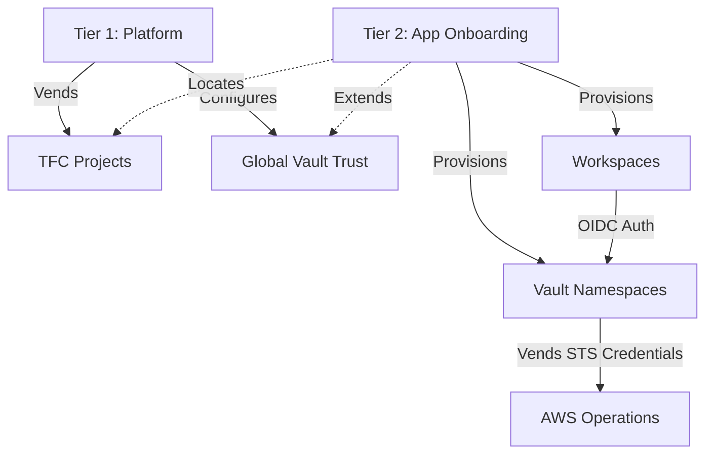

# Terraform Landing Zone

A module to onboard apps into Terraform Cloud (TFC) and Vault. We use HashiCorp's Validated Patterns instead of a massive monolith.

## Structure

Divided into two main pieces:

- `tier-1-platform/`: For platform admins. Run this to stand up global TFC projects and configure the base Vault JWT backend. 
- `tier-2-app-onboarding/`: For app teams. Uses data sources to find Tier 1 outputs and provisions workspaces, Vault endpoints, and AWS secret engines safely without stepping on the global config.



## Vault Dynamic Credentials

No static AWS credentials here. We use Vault-backed dynamic ones.
Workspaces hit Vault with built-in TFC OIDC tokens. Vault validates them and returns short-lived STS tokens.

By default this uses `assumed_role` tokens. If a specific environment needs standard `iam_user` access keys, override it via the `vault_backed_aws_auth_type_map` variable inside tier-2.

## Local Guardrails

We use standard pre-commit hooks so syntax errors don't blow up TFC runs.

Setup instructions:
```bash
brew install pre-commit tflint trivy terraform-docs
pre-commit install
```

When you commit, the hooks will:
- auto-format the terraform files
- update module READMEs 
- enforce AWS rules and snake_case via tflint (`.tflint.hcl`)
- run trivy static analysis

## Modules
The modules doing the actual work are in `standalone-repos/`. Tier 1 and Tier 2 just wrap them.
- `terraform-tfe-workspace`
- `terraform-vault-auth`
- `terraform-vault-namespace`
- `terraform-vault-aws`

## Testing

Use `auto_live_demo.sh` to test changes locally. It provisions a scratch environment, makes an app workspace, and hits AWS to confirm the STS tokens are generated properly.

<!-- BEGIN_TF_DOCS -->
## Requirements

| Name | Version |
| ---- | ------- |
| <a name="requirement_terraform"></a> [terraform](#requirement\_terraform) | >= 1.6.0 |
| <a name="requirement_tfe"></a> [tfe](#requirement\_tfe) | >= 0.58.0, < 1.0.0 |
| <a name="requirement_vault"></a> [vault](#requirement\_vault) | >= 4.0.0, < 6.0.0 |
<!-- END_TF_DOCS -->
