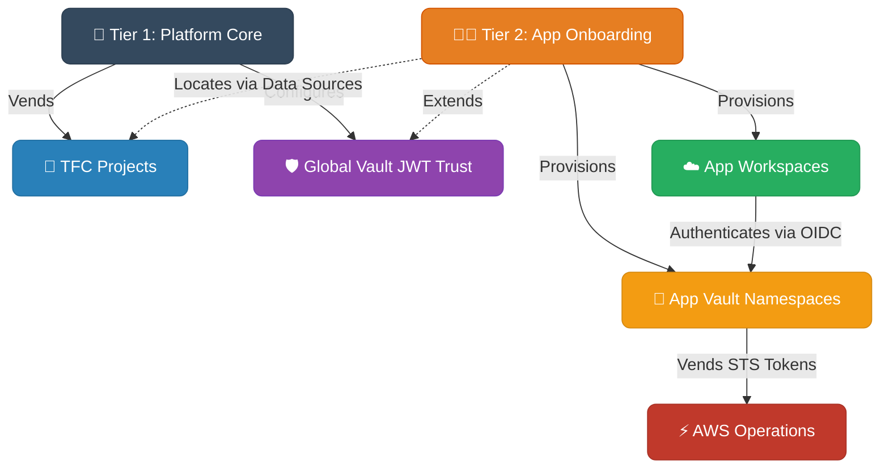

# Enterprise Terraform Landing Zone

I built this repo to automate how we onboard applications into HashiCorp Terraform Cloud (TFC) and Vault. 
The old monolithic module got way too messy, so I broke it down into a strict tiered structure based on HashiCorp's Validated Patterns.

### The Architecture: Tier 1 vs Tier 2
Instead of tossing everything into one giant run, the setup is split by admin boundaries.



- **`tier-1-platform/`**: This is for the Platform Admins. It spins up the global Terraform Cloud Projects and the core Vault JWT Auth backend. You run this once per business unit or major environment.
- **`tier-2-app-onboarding/`**: This is for Application Teams asking for infrastructure. It looks up the stuff made in Tier 1 using data sources and safely provisions their specific workspaces, Vault Sub-Namespaces, and AWS Secrets Engines. 

It prevents teams from stepping on each other's toes or messing with the global OIDC trust.

### Vault & Dynamic Provider Credentials (DPC)
I ripped out all static AWS credentials. 
This repo explicitly uses **Vault-Backed Dynamic Credentials**.
- TFC workspaces authenticate to Vault using their native OIDC tokens.
- Vault verifies the JWT and issues an STS token (`assumed_role`) for getting into AWS.

To do this properly, I added the `vault_backed_aws_auth_type_map` variable inside `tier-2` so you can securely override whether an environment gets `assumed_role` or standard `iam_user` keys on the fly without breaking the global config.

### Local Guardrails 
I got tired of syntax errors failing halfway through TFC runs, so I ported the strict local guardrails from IBM's enterprise repos.

If you are developing here, you need to run:
```bash
brew install pre-commit tflint trivy terraform-docs
pre-commit install
```

Once you do that, every time you try to commit code, it will automatically:
- Run `terraform fmt` across everything
- Run `terraform-docs` to rebuild the sub-READMEs so I don't have to write them manually
- Lint your code specifically against AWS and standard naming rules (check `.tflint.hcl`)
- Run a Trivy static analysis scan to catch stuff before it hits the provider

### Modules
All reusable components are isolated inside `standalone-repos/`. The tiers just invoke them like normal modules.
- `terraform-tfe-workspace`
- `terraform-vault-auth`
- `terraform-vault-namespace`
- `terraform-vault-aws`

### Live Testing
If you want to test the entire AWS OIDC -> Vault -> TFC flow without breaking production state, run the `auto_live_demo.sh` script. It spins up a temporary sandbox environment, provisions an app workspace, and applies a dummy AWS S3 bucket to verify the Vault STS tokens are actually working.
